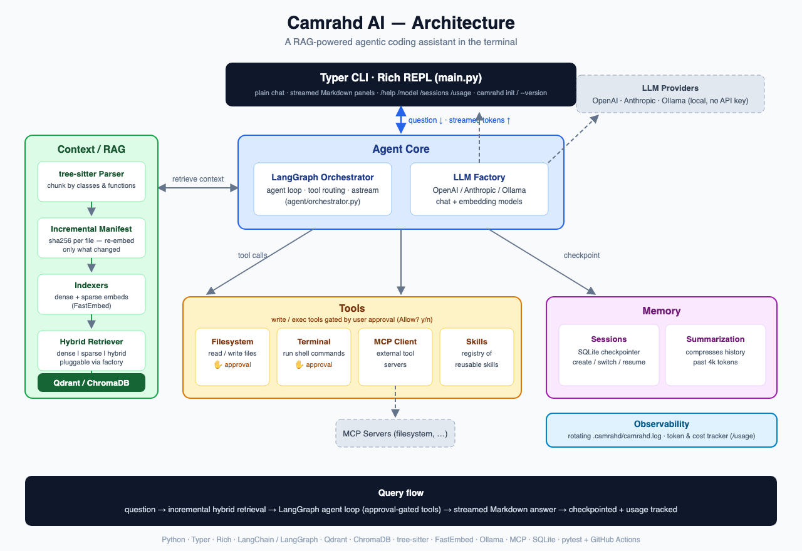

# Camrahd AI

A Claude Code–style AI coding agent that lives in your terminal. Built from scratch in Python to understand how agentic coding assistants actually work under the hood: code-aware retrieval, tool orchestration, streaming, persistent memory, and MCP integration.

```
╭──────────── Camrahd AI v0.2.0 ────────────╮
│ LLM       openai / gpt-5.5                │
│ Embedder  openai / text-embedding-3-small │
│ Repo      ~/projects/my-app               │
│ Session   2a1f…                           │
╰───────────────── ✓ ready ─────────────────╯
Type a question, or /help for commands.

❯ how does the indexing pipeline work?
```

## Features

- **Plain chat REPL** — Just type a question; answers stream token by token and render live as Markdown in a rich panel. `/` is reserved for commands.
- **Code-aware chunking** — Uses [tree-sitter](https://tree-sitter.github.io/) to parse source files into semantic chunks (classes, functions) instead of naive text splitting, so retrieval respects code structure.
- **Incremental re-indexing** — A sha256 manifest per file means only changed files are re-embedded on launch; chunks of deleted files are cleaned up. Full re-indexing never happens twice.
- **Hybrid RAG** — Dense + sparse retrieval over Qdrant (via FastEmbed), with a pluggable indexer/retriever layer that also supports ChromaDB and pure semantic mode.
- **Agentic tool use** — The agent can read/write files and run terminal commands through a LangGraph-orchestrated agent loop.
- **Tool-call approval** — Before the agent runs a shell command or writes/deletes a file, it shows you exactly what it wants to do and asks `Allow? [y/n]`. Denials are fed back to the agent so it can adjust.
- **Persistent sessions** — Short-term memory checkpointed to SQLite; create, list, switch, and resume conversations across runs.
- **Automatic summarization** — Long conversations are summarized past a token threshold (`summarize_at_tokens`) so the agent stays coherent in long sessions.
- **MCP integration** — Connects to Model Context Protocol servers (e.g. filesystem MCP) to consume external tools without hardcoding them.
- **Skills system** — A registry of reusable skills loaded from `.camrahd/skills/` that extend the agent's behavior without touching core code.
- **Multi-provider, including local** — Swap between OpenAI, Anthropic, and Ollama (fully offline, no API key) models and embedders via config, or at runtime with `/model`.
- **Usage tracking** — Token counts per session (and dollar cost, if you configure pricing) shown after each answer and via `/usage`.
- **Observability** — All logs go to one rotating file (`.camrahd/camrahd.log`) so the UI stays clean; only warnings surface in the terminal.

## Architecture



```
camrahd_ai/
├── main.py                 # Typer CLI + rich REPL (chat, init, --version)
├── config.py / config.yaml # Provider, RAG mode, memory, tools, logging settings
├── agent/                  # Agent factory, orchestrator (streaming), tool bindings
├── context/
│   ├── indexers/           # tree-sitter parser, incremental manifest, Qdrant/Chroma indexers
│   └── retrievers/         # semantic + hybrid retrievers
├── llm/                    # LLM & embedder factories (OpenAI / Anthropic / Ollama)
├── memory/                 # Session management, SQLite checkpointing
├── mcp/                    # MCP client & server config
├── skills/                 # Skill registry & tools
├── tools/                  # Filesystem & terminal tools + approval gate
└── observability/          # Rotating file logging, token/cost tracking
tests/                      # pytest suite (run in CI on every push)
```

**Query flow:** question → incremental hybrid retrieval over the indexed codebase → context assembled into the agent's prompt → LangGraph agent loop with approval-gated tool calls (filesystem, terminal, MCP, skills) → answer streamed as Markdown, checkpointed to the session with usage tracked.

## Getting started

### Prerequisites

- Python 3.12 (not 3.13+ — the tree-sitter grammar bundle has no newer wheels)
- A running [Qdrant](https://qdrant.tech/) instance (`docker run -d -p 6333:6333 qdrant/qdrant`), or switch to ChromaDB in config — no Docker needed
- An OpenAI or Anthropic API key — or none at all with [Ollama](https://ollama.com/)

### Install & run

```bash
# Recommended: pipx keeps it isolated (use --python python3.12 if your default is newer)
pipx install "camrahd-ai[qdrant] @ git+https://github.com/Camrahd/camrahd-ai.git"
# extras: [qdrant] | [chroma] | [huggingface] | [ollama] | [all]

# Add your API key (also read from ~/.config/camrahd/.env)
echo "OPENAI_API_KEY=sk-..." > .env

# Run from the repo you want to index (defaults to cwd)
camrahd            # chat REPL
camrahd init       # write a starter camrahd.yaml to customize
camrahd --version
```

Or from source:

```bash
git clone https://github.com/Camrahd/camrahd-ai.git
cd camrahd-ai
poetry install --extras qdrant
poetry run camrahd
```

On first run, the agent indexes the current working directory and drops you into the REPL. Subsequent launches only re-embed files that changed.

### Commands

| Command | Description |
|---|---|
| `<question>` | Just type — no prefix needed |
| `/help` | Show all commands |
| `/show_index` | Show all chunks in the index |
| `/new_session` | Start a fresh conversation |
| `/sessions` | List all past sessions |
| `/switch <session_id>` | Resume a past session |
| `/session` | Show the current session id |
| `/model [provider] [name]` | Show or switch the LLM at runtime |
| `/usage` | Show session token usage (and cost) |
| `/exit` | Quit (Ctrl+C / Ctrl+D also exit cleanly) |

## Configuration

Defaults ship with the package; override any subset in a `camrahd.yaml` in your project directory (`camrahd init` creates one) or `~/.config/camrahd/config.yaml`:

```yaml
llm:
  provider: openai        # openai | anthropic | ollama
  model: gpt-5.5
  # base_url: http://localhost:11434   # ollama only

vector_store:
  provider: qdrant        # qdrant | chromadb
  retrieval_mode: hybrid  # dense | sparse | hybrid

memory:
  summarize_at_tokens: 4000
  keep_last_messages: 20

tools:
  require_approval: true  # ask before shell commands / file writes

logging:
  file: .camrahd/camrahd.log
  level: DEBUG

# Optional: turn token counts into dollar cost in /usage
# pricing:
#   input_per_1m: 2.50
#   output_per_1m: 10.00
```

### Running fully local with Ollama

```yaml
llm:
  provider: ollama
  model: qwen2.5-coder:7b
embeddings:
  provider: ollama
  model: nomic-embed-text
```

No API keys, nothing leaves your machine.

## Development

```bash
poetry install --extras all
poetry run pytest        # 21 tests; also run by GitHub Actions on every push
```

## Why I built this

Tools like Claude Code feel like magic, but the magic isn't the LLM — it's the engineering around it. Building this taught me that context management, retrieval quality, and tool orchestration are where coding agents are won or lost.

## Tech stack

Python · Typer · Rich · LangChain / LangGraph · Qdrant · ChromaDB · tree-sitter · FastEmbed · Ollama · MCP · SQLite · pytest + GitHub Actions
